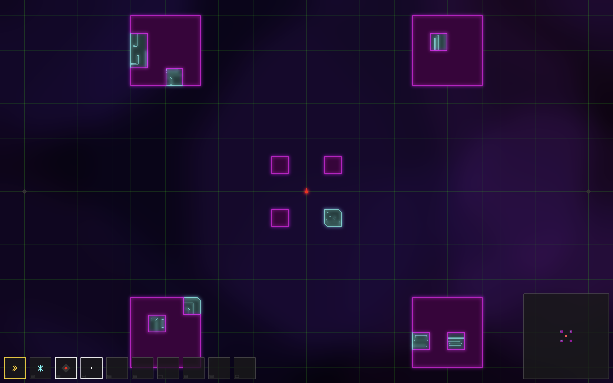

# Hybrid



A bullet hell shooter meets Metroidvania, set inside cyberspace.

A human brain has been interfaced with a computer system for the first time. You are the **Hybrid** — a fusion of human mind and AI consciousness navigating a hostile digital world. Security programs hunt you. Intrusion detection devices litter every corridor. And somewhere deep in the network, an alien superintelligence is projecting itself into Earth's cyberspace.

## Gameplay

- **Movement**: WASD to navigate the grid. Aim with the mouse.
- **Subroutines**: Abilities your AI executes — projectiles, dashes, deployable mines, speed boosts. Equip them in the skill bar (keys 1-9, 0) and activate with type-specific inputs (LMB to fire, Shift to dash, Space to deploy).
- **Progression**: Destroy security programs to collect fragments. Gather enough fragments to unlock new subroutines derived from that enemy type.
- **Exploration**: Interconnected zones with ability-gated progression. Without the right subroutines, areas are effectively impossible to survive.
- **God Mode**: Built-in level editor. Press G to toggle — place walls, spawn enemies, build zones. Ctrl+Z to undo. Everything persists to zone files automatically.

## Subroutines

| Subroutine | Type | Description |
|------------|------|-------------|
| sub_pea | Projectile | Fires white dots toward cursor. 8-projectile pool, swept collision. |
| sub_mine | Deployable | Place up to 3 mines. 2s fuse, 250ms cooldown. |
| sub_egress | Movement | Dash burst in facing direction. 150ms at 5x speed, 2s cooldown. |
| sub_boost | Movement (Elite) | Hold Shift for unlimited speed boost. No cooldown. |

Many more planned — each enemy type yields a corresponding subroutine.

## Tech Stack

- **Language**: C99
- **Graphics**: SDL2 + OpenGL 3.3 Core Profile
- **Audio**: SDL2_mixer
- **Text**: stb_truetype bitmap font rendering
- **Architecture**: Custom ECS (Entity Component System)
- **UI**: Custom immediate-mode GUI

### Rendering

- Batch renderer with three primitive types (triangles, lines, points)
- Dual FBO post-process bloom — neon entity halos + diffuse background clouds
- 9-tap separable gaussian blur, ping-pong at configurable resolution
- Three-layer parallax background with tiled irregular polygon clouds
- Motion trails on ship boost and projectiles
- All entity rendering goes through a `Render_*` abstraction layer — zero GL calls in game logic

### World

- Zone-based level system with text-format `.zone` files
- In-game editor (God Mode) with persistent editing and stepwise undo
- Zone-specific cell type definitions for themed environments (fire, ice, poison, etc.)
- Portal system for zone transitions

## Building

Requires SDL2, SDL2_mixer, and OpenGL 3.3+ support.

```
brew install sdl2 sdl2_mixer   # macOS
make compile
./hybrid
```

## Controls

| Key | Action |
|-----|--------|
| WASD | Move |
| Mouse | Aim |
| LMB | Fire projectile |
| Space | Deploy mine |
| Shift | Movement subroutine (dash/boost) |
| 1-9, 0 | Activate skill slot |
| P | Open Subroutine Registry |
| G | Toggle God Mode |
| Ctrl+Z | Undo (God Mode) |
| ESC | Close windows / Menu |

## Project Status

This is an active work-in-progress. Core systems are functional — ship movement, combat, progression, skill management, zone editing, bloom rendering, and the full subroutine equip pipeline. See `PRD.md` for the complete vision and detailed feature status.
